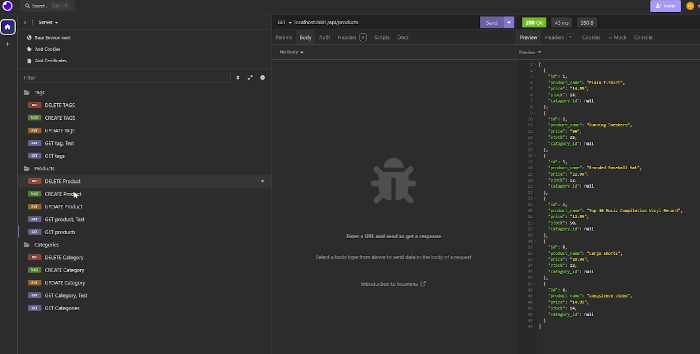
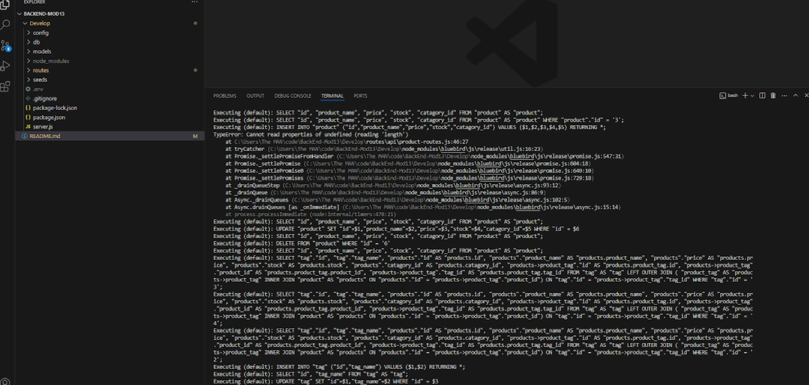

# E-Commerce Back End
## Description
Module 13 Challenge, Manage Products, Tags, Categories in the server database. My Challenge was to build the back end for an e-commerce site. Taking a working Express.js API and configure it to use Sequelize to interact with a PostgreSQL database.
## Installation
Download Repo on GitHub: https://github.com/WickedDan/BackEnd-Mod13.git
## Usuage Information
Run the server.js file. Then connected to it using insomia to manage routes and data.
## Questions 
If you have questions check out my github WickedDan or you can email me at daniel@wickedflow.com;
## Screenshots

## Deployment Link
https://github.com/WickedDan/BackEnd-Mod13.git
